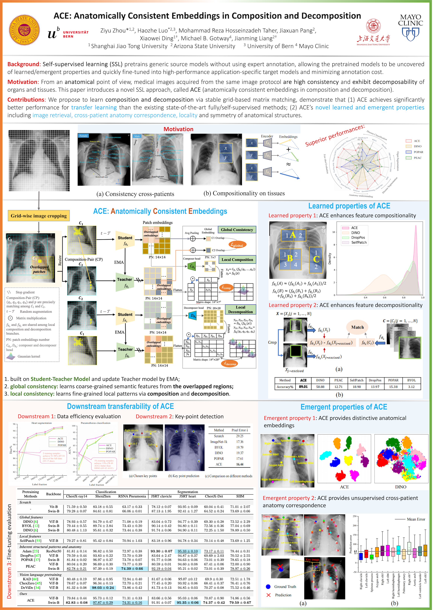

# ACE: Anatomically Consistency Embedding via Composition and Decomposition

This paper introduces a novel SSL approach called ACE to learn **a**natomically **c**onsistent **e**mbedding via composition and decomposition with two key branches: (1) global consistency, capturing discriminative macro-structures via extracting global features; (2) local consistency, learning fine-grained anatomical details from composable/decomposable patch features via corresponding matrix matching. Experimental results across 6 datasets 2 backbones, evaluated in few-shot learning, fine-tuning, and property analysis, show ACE’s superior robustness, transferability, and clinical potential.

<p align="center"></p>


## Publication

**ACE: Anatomically Consistency Embedding via Composition and Decomposition**<br/>
[Ziyu Zhou](https://scholar.google.com/citations?hl=en&user=nvAfKnsAAAAJ)<sup>1,2</sup>, [Haozhe Luo](https://roypic.github.io//)<sup>3</sup>, [Mohammad Reza Hosseinzadeh Taher](https://github.com/MR-HosseinzadehTaher)<sup>2</sup>, [Jiaxuan Pang](https://www.linkedin.com/in/jiaxuan-pang-b014ab127/)<sup>2</sup>, [Xiaowei Ding](https://ee.sjtu.edu.cn/en/FacultyDetail.aspx?id=200&infoid=153&flag=153)<sup>1</sup>, [Michael B. Gotway](https://www.mayoclinic.org/biographies/gotway-michael-b-m-d/bio-20055566)<sup>4</sup>, [Jianming Liang](https://search.asu.edu/profile/1310161)<sup>2</sup><br/>
<sup>1 </sup>Shanghai Jiao Tong University, <sup>2 </sup>Arizona State University, <sup>3 </sup>University of Bern <br/>, <sup>4 </sup>Mayo Clinic <br/>
(Ziyu Zhou and Haozhe Luo contribute equally for this paper.)<br/>

[Paper](https://arxiv.org/abs/2501.10131) | [Poster](images/ACE_poster_A0.pdf) | [Presentation](https://www.bilibili.com/video/BV1ey1ZBqES3/?spm_id_from=333.1387.homepage.video_card.click&vd_source=0199850c2eb71ce8f33bc8e329957840)


:star: ${\color{blue} {\textbf{Please download the pretrained ACE PyTorch model as follow. }}}$

| Model name | Backbone | Pretrained dataset | Input Resolution | model |
|------------|----------|------------------|------------------|-------|
| ACE | SwinV1-base | [ChestX-ray14](https://nihcc.app.box.com/v/ChestXray-NIHCC) | 448x448 | [Dropbox](https://www.dropbox.com/scl/fi/civ4cuheis4wqm0suwe68/ACE_v1_NIH_swinv1.pth?rlkey=k2hk56gc1px6pee8ua86aw8m5&st=fexvaek8&dl=0) \| [BaiduDisk](https://pan.baidu.com/s/1QdPAE7C2QGBfNN-1BYJVyA?pwd=rgaf)
| ACE | ViT-base | [ChestX-ray14](https://nihcc.app.box.com/v/ChestXray-NIHCC) | 448x448 | [Dropbox](https://www.dropbox.com/scl/fi/vduk2d0n5qx0q6yggc7a7/ACE_vitb.pth?rlkey=v0i9w4ivht06wrkqdcsqnewij&st=q05atulw&dl=0) \| [BaiduDisk](https://pan.baidu.com/s/1iFNsVo-irZe-kowK0VEHUA?pwd=jc38)


## Dataset
1. [ChestX-ray14](https://nihcc.app.box.com/v/ChestXray-NIHCC)
2. [RSNA Pneumonia](https://www.kaggle.com/c/rsna-pneumonia-detection-challenge)
3. [Shenzhen](https://lhncbc.nlm.nih.gov/LHC-downloads/downloads.html#tuberculosis-image-data-sets)
4. [JSRT](http://db.jsrt.or.jp/eng.php)
5. [SIIM](https://www.kaggle.com/datasets/vbookshelf/pneumothorax-chest-xray-images-and-masks/data)
6. [ChestX-Det](https://github.com/Deepwise-AILab/ChestX-Det-Dataset?tab=readme-ov-file)

## Code

### Requirements
+ python >= 3.9
+ Pytorch ([pytorch.org](https://pytorch.org/))

### Setup environment
Create a new environment and activate it:
```
$ conda create -n ACE python==3.9
$ conda activate ACE
```

Install Pytorch according to the CUDA version (e.g., CUDA 12.6):
```
$ pip3 install torch torchvision --index-url https://download.pytorch.org/whl/cu126
```

Clone the repository:
```
$ git clone https://github.com/jlianglab/ACE.git
$ cd ACE
$ cd ACE_v1
$ pip install -r requirements
```

### Pretrain ACE-v1 model
```
# Train ACE-v1 model based on DDP
CUDA_VISIBLE_DEVICES="0,1" python -m torch.distributed.launch --nproc_per_node=2 --master_port 28301 main.py --arch swin_base --batch_size_per_gpu 8 --data_path pretrain image path --output_dir 
```

### Evaluate ACE-v2 pretrained model

1. Load the model

Load the SwinV1-base code in [swin_transformer.py](./models/swin_transformer.py):
```
from models.swin_transformer import SwinTransformer
model = SwinTransformer(img_size= 448, patch_size=4, window_size=7, embed_dim=128, depths=(2, 2, 18, 2), num_heads=(4, 8, 16, 32), num_classes=3, use_dense_prediction=True)
```


2. Load the pretrained weights

```
checkpoint = torch.load(model_path, map_location='cpu')
checkpoint = checkpoint['teacher']
checkpoint = {k.replace("backbone.", ""): v for k, v in checkpoint.items()}
msg = model.load_state_dict(checkpoint, strict=False)
print(msg)
```


3. Finetune the pretrained model on target tasks

Refer the finetuning codes in [Finetune](../downstream/Finetune/).


## Citation
If you use this code or use our pre-trained weights for your research, please cite our paper:
```
@inproceedings{zhou2025ace,
  title={ACE: Anatomically Consistent Embeddings in Composition and Decomposition},
  author={Zhou, Ziyu and Luo, Haozhe and Taher, Mohammad Reza Hosseinzadeh and Pang, Jiaxuan and Ding, Xiaowei and Gotway, Michael and Liang, Jianming},
  booktitle={2025 IEEE/CVF Winter Conference on Applications of Computer Vision (WACV)},
  pages={3823--3833},
  year={2025},
  organization={IEEE}
}
```


## Acknowledgement
This research has been supported in part by ASU and Mayo Clinic through a Seed Grant and an Innovation Grant, and in part by the NIH under Award Number R01HL128785. The content is solely the responsibility of the authors and does not necessarily represent the official views of the NIH. This work has utilized the GPUs provided in part by the ASU Research Computing and in part by Sol and Bridges-2 at Pittsburgh Supercomputing Center through allocation BCS190015 and the Anvil at Purdue University through allocation MED220025 from the Advanced Cyberinfrastructure Coordination Ecosystem: Services \& Support (ACCESS) program, which is supported by National Science Foundation grants \#2138259, \#2138286, \#2138307, \#2137603, and \#2138296. The content of this paper is covered by patents pending.


## License

Released under the [ASU GitHub Project License](./LICENSE).