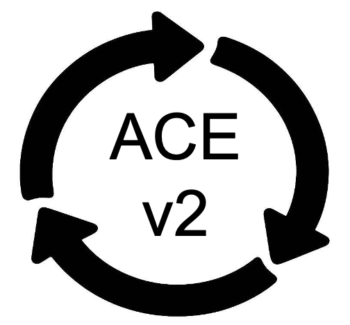
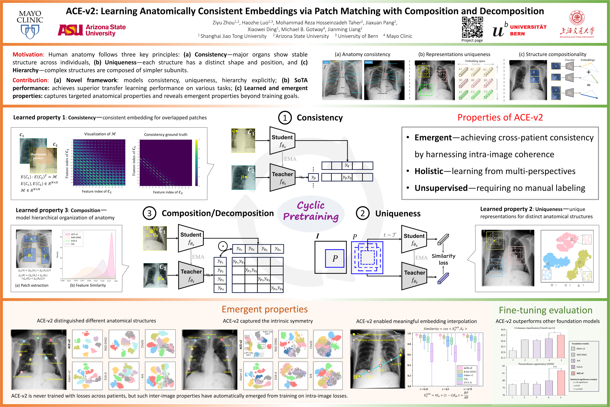

<p align="center"></p>

# ACE-v2: Learning Anatomically Consistent Embeddings via Patch Matching with Composition and Decomposition

We present ACE-v2, a novel SSL framework that learns deep anatomical representations from unlabeled chest radiographs by explicitly modeling three fundamental properties of human anatomy: **uniqueness, consistency, and composition/decomposition**. To this end, ACE-v2 introduces (1) multi-scale, center-aligned crops to capture structure-specific embeddings, (2) a grid-based cropping scheme with controlled overlap to establish fine-grained anatomical consistency, and (3) a composition-aware strategy to align whole-part relationships across views. These objectives are integrated via a **cyclic pretraining** strategy based on student-teacher architecture to progressively accumulate anatomical knowledge.

<p align="center"></p>

:star: ${\color{blue} {\textbf{Please download the pretrained ACE-v2 PyTorch model as follow. }}}$

| Model name | Backbone | Pretrained dataset | Input Resolution | model |
|------------|----------|------------------|------------------|-------|
| ACE-v2<sub>SwinV1-B<sub> | SwinV1-base | [ChestX-ray14](https://nihcc.app.box.com/v/ChestXray-NIHCC) | 448x448 | [Dropbox](https://www.dropbox.com/scl/fi/m3w5xg3e73di1p7ccjvig/ACE_v2_NIH_swinv2.pth?) \| [BaiduDisk](https://pan.baidu.com/s/1DBqvX6nDS8a_4XDRPP9h6A?pwd=tizf)
|ACE-v2<sub>SwinV2-B<sub> | SwinV2-base |[ChestX-ray14](https://nihcc.app.box.com/v/ChestXray-NIHCC) | 512x512 | [Dropbox](https://www.dropbox.com/scl/fi/m3w5xg3e73di1p7ccjvig/ACE_v2_NIH_swinv2.pth?rlkey=po6yzkkyv8dt8r18mzd86t2d8&st=ogz3hbs9&dl=0) \| [BaiduDisk](https://pan.baidu.com/s/1W1RAXOMo8SzV5ZNGF6XKkw?pwd=sjnu)
|ACE-v2 | SwinV2-base |ChestX-ray1M | 512x512 | [Dropbox](https://www.dropbox.com/scl/fi/6k48jb4x8uttijuaof476/ACE_v2_largescale_swinv2.pth?rlkey=aacc7tflvs497lxhp92xs0x77&st=467y9xbo&dl=0) \| [BaiduDisk](https://pan.baidu.com/s/1jCVtLQ5rbNzjMKn7PyqFBA?pwd=d5e8)


## Dataset
1. [ChestX-ray14](https://nihcc.app.box.com/v/ChestXray-NIHCC)
2. [RSNA Pneumonia](https://www.kaggle.com/c/rsna-pneumonia-detection-challenge)
3. [Shenzhen](https://lhncbc.nlm.nih.gov/LHC-downloads/downloads.html#tuberculosis-image-data-sets)
4. [JSRT](http://db.jsrt.or.jp/eng.php)
5. [SIIM](https://www.kaggle.com/datasets/vbookshelf/pneumothorax-chest-xray-images-and-masks/data)
6. [COVID-QU-Ex](https://www.kaggle.com/datasets/anasmohammedtahir/covidqu)
7. ChestLandmarks
8. ChestX-ray1M: consisting of 1.04M chest X-ray images from 17 datasets, detailed as follow:

|Index | Pretraining Datasets-Xray | Numbers (train split) |
|------------|------------|----------|
|1 | MIMIC-CXR |377028 |
|2 | CheXpert |223414 |
|3 | PadChest |160828 |
|4 | [ChestX-ray14](https://nihcc.app.box.com/v/ChestXray-NIHCC) |86524 |
|5 | [JSRT](http://db.jsrt.or.jp/eng.php) |247 |
|6 | Mendeley-V2 |5232 |
|7 | Montgomery |138 |
|8 | [Shenzhen](https://lhncbc.nlm.nih.gov/LHC-downloads/downloads.html#tuberculosis-image-data-sets) |662 |
|9 | [RSNA Pneumonia](https://www.kaggle.com/c/rsna-pneumonia-detection-challenge) |26684 |
|10 | Indiana ChestX-ray (Open-I) |7883 |
|11 | COVIDx |1223 |
|12 | COVID-19 RADIOGRAPHY_DATABASE |21165 |
|13 | VinDr-CXR |15000 |
|14 | RSNA International COVID-19 Open Radiology Database (RICORD) |1005 |
|15 | PLCO |89716 |
|16 | NIH TB |12769 |
|17 | [SIIM](https://www.kaggle.com/datasets/vbookshelf/pneumothorax-chest-xray-images-and-masks/data) |10675 |
||Total| 1040193|


## Code

### Requirements
+ python >= 3.9
+ Pytorch ([pytorch.org](https://pytorch.org/))

### Setup environment
Create a new environment and activate it:
```
$ conda create -n ACE python==3.9
$ conda activate ACE
```

Install Pytorch according to the CUDA version (e.g., CUDA 12.6):
```
$ pip3 install torch torchvision --index-url https://download.pytorch.org/whl/cu126
```

Clone the repository:
```
$ git clone https://github.com/jlianglab/ACE.git
$ cd ACE
$ pip install -r requirements
```

### Pretrain ACE-v2 model
```
# Train ACE-v2 model based on DDP
CUDA_VISIBLE_DEVICES="0,1,2,3" python -m torch.distributed.launch --nproc_per_node=4 --master_port 28301 main.py --arch swin_base --batch_size_per_gpu 16 --image_size 448 --data_path your_pretrain_image_path --output_dir your_saving_path
```

### Evaluate ACE-v2 pretrained model

#### Load the model

Load the SwinV1-base code in [swin_transformer.py](./models/swin_transformer.py):
```
from models.swin_transformer import SwinTransformer
model = SwinTransformer(img_size= 448, patch_size=4, window_size=7, embed_dim=128, depths=(2, 2, 18, 2), num_heads=(4, 8, 16, 32), num_classes=3, use_dense_prediction=True)
```

Load the SwinV2-base code in [swin_transformer_v2.py](./models/swin_transformer_v2.py):
```
from models.swin_transformer_v2 import SwinTransformerV2
model = SwinTransformerV2(img_size= 512, patch_size=4, window_size=16, embed_dim=128, depths=(2, 2, 18, 2), num_heads=(4, 8, 16, 32), num_classes=3, use_dense_prediction=True)
```


#### Load the pretrained weights

```
checkpoint = torch.load(model_path, map_location='cpu')
checkpoint = checkpoint['teacher']
checkpoint = {k.replace("backbone.", ""): v for k, v in checkpoint.items()}
msg = model.load_state_dict(checkpoint, strict=False)
print(msg)
```


#### Finetune the pretrained model on target tasks
Refer the finetuning codes in [Finetune](../downstream/Finetune/).

#### Evaluate the learned and emergent properties of the pretrained model
Refer the evaluation codes in [Property](../downstream/Property/).


### Citation
If you use this code or use our pre-trained weights for your research, please cite our paper:


### Acknowledgement
This research has been supported in part by ASU and Mayo Clinic through a Seed Grant and an Innovation Grant, and in part by the NIH under Award Number R01HL128785. The content is solely the responsibility of the authors and does not necessarily represent the official views of the NIH. This work has utilized the GPUs provided in part by the ASU Research Computing and in part by Sol and Bridges-2 at Pittsburgh Supercomputing Center through allocation BCS190015 and the Anvil at Purdue University through allocation MED220025 from the Advanced Cyberinfrastructure Coordination Ecosystem: Services \& Support (ACCESS) program, which is supported by National Science Foundation grants \#2138259, \#2138286, \#2138307, \#2137603, and \#2138296. The content of this paper is covered by patents pending.