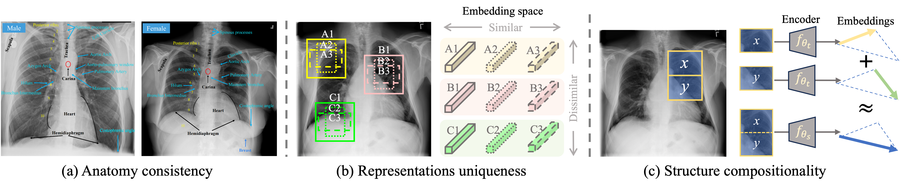

<p align="center"></p>


This paper introduces ACE, a novel self-supervised learning (SSL) approach for learning an **A**natomically **C**onsistent **E**mbedding by enforcing global and local consistency through feature composition and decomposition. Its successor, **ACE-v2**, presents a more comprehensive SSL framework that explicitly models three fundamental properties of human anatomy—uniqueness, consistency, and composition/decomposition—to learn deep representations from unlabeled chest X-rays. This evolution enables ACE-v2 to more systematically accumulate anatomical knowledge, demonstrating superior robustness, transferability, and enhanced clinical potential across multiple datasets and tasks.


<p align="center"></p>


## Publication

**ACE: Anatomically Consistency Embedding via Composition and Decomposition**<br/>
[Ziyu Zhou](https://scholar.google.com/citations?hl=en&user=nvAfKnsAAAAJ)<sup>1,2</sup>, [Haozhe Luo](https://roypic.github.io//)<sup>3</sup>, [Mohammad Reza Hosseinzadeh Taher](https://github.com/MR-HosseinzadehTaher)<sup>2</sup>, [Jiaxuan Pang](https://www.linkedin.com/in/jiaxuan-pang-b014ab127/)<sup>2</sup>, [Xiaowei Ding](https://ee.sjtu.edu.cn/en/FacultyDetail.aspx?id=200&infoid=153&flag=153)<sup>1</sup>, [Michael B. Gotway](https://www.mayoclinic.org/biographies/gotway-michael-b-m-d/bio-20055566)<sup>4</sup>, [Jianming Liang](https://search.asu.edu/profile/1310161)<sup>2</sup><br/>
<sup>1 </sup>Shanghai Jiao Tong University, <sup>2 </sup>Arizona State University, <sup>3 </sup>University of Bern <br/>, <sup>4 </sup>Mayo Clinic <br/>
(Ziyu Zhou and Haozhe Luo contribute equally for this paper.)<br/>

[Paper](https://arxiv.org/abs/2501.10131) | [Poster](images/ACE_poster_A0.pdf) | [Presentation](https://www.bilibili.com/video/BV1ey1ZBqES3/?spm_id_from=333.1387.homepage.video_card.click&vd_source=0199850c2eb71ce8f33bc8e329957840)


:star: ${\color{blue} {\textbf{Please download the pretrained ACE-v2 PyTorch model as follow. }}}$

| Model name | Backbone | Pretrained dataset | Input Resolution | model |
|------------|----------|------------------|------------------|-------|
| ACE | SwinV1-base | [ChestX-ray14](https://nihcc.app.box.com/v/ChestXray-NIHCC) | 448x448 | [Dropbox](https://www.dropbox.com/scl/fi/civ4cuheis4wqm0suwe68/ACE_v1_NIH_swinv1.pth?rlkey=k2hk56gc1px6pee8ua86aw8m5&st=fexvaek8&dl=0) \| [BaiduDisk](https://pan.baidu.com/s/1QdPAE7C2QGBfNN-1BYJVyA?pwd=rgaf)
| ACE | ViT-base | [ChestX-ray14](https://nihcc.app.box.com/v/ChestXray-NIHCC) | 448x448 | [Dropbox](https://www.dropbox.com/scl/fi/vduk2d0n5qx0q6yggc7a7/ACE_vitb.pth?rlkey=v0i9w4ivht06wrkqdcsqnewij&st=q05atulw&dl=0) \| [BaiduDisk](https://pan.baidu.com/s/1iFNsVo-irZe-kowK0VEHUA?pwd=jc38)


## Citation
If you use this code or use our pre-trained weights for your research, please cite our paper:
```
@inproceedings{zhou2025ace,
  title={ACE: Anatomically Consistent Embeddings in Composition and Decomposition},
  author={Zhou, Ziyu and Luo, Haozhe and Taher, Mohammad Reza Hosseinzadeh and Pang, Jiaxuan and Ding, Xiaowei and Gotway, Michael and Liang, Jianming},
  booktitle={2025 IEEE/CVF Winter Conference on Applications of Computer Vision (WACV)},
  pages={3823--3833},
  year={2025},
  organization={IEEE}
}
```


## Acknowledgement
This research has been supported in part by ASU and Mayo Clinic through a Seed Grant and an Innovation Grant, and in part by the NIH under Award Number R01HL128785. The content is solely the responsibility of the authors and does not necessarily represent the official views of the NIH. This work has utilized the GPUs provided in part by the ASU Research Computing and in part by Sol and Bridges-2 at Pittsburgh Supercomputing Center through allocation BCS190015 and the Anvil at Purdue University through allocation MED220025 from the Advanced Cyberinfrastructure Coordination Ecosystem: Services \& Support (ACCESS) program, which is supported by National Science Foundation grants \#2138259, \#2138286, \#2138307, \#2137603, and \#2138296. The content of this paper is covered by patents pending.


## License

Released under the [ASU GitHub Project License](./LICENSE).